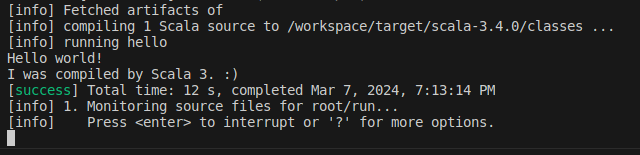
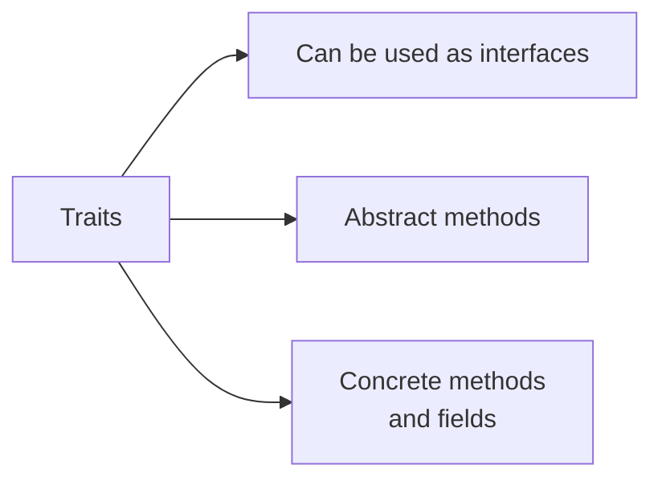
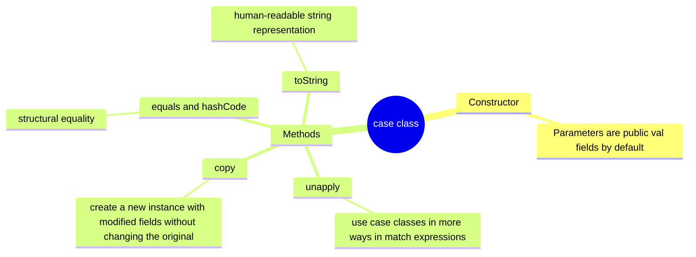
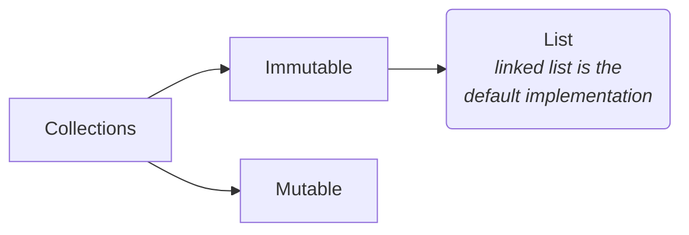

# Scala learning
> Scala is an expressive programming language, with a clean, modern syntax, which supports functional programming (FP) and object-oriented programming (OOP), and that provides a safe static type system. 

### Using the scala workspace
~~~bash
docker-compose up -d
docker-compose exec devcontainer bash
~~~
The project files are mounted in `/workspace` directory.

---

### Create the project
~~~bash
sbt new scala/scala3.g8
~~~
Enter the project name.

[Create project reference](https://docs.scala-lang.org/getting-started/index.html)

---

### Run
~~~bash
# open the sbt console
sbt

# the ~ is optional. It causes sbt to re-run on every file save.
~run
~~~


## The REPL
Running `scala` command in the terminal.

## Variables and Data Types
> In Scala, everything is an object.

| Type | Description |
| --- | --- |
| val | Immutable - like final in Java |
| var | Mutable |

### Declaring variable types
```scala
val x: Int = 1
val x = 1
val nums: List[Int] = List(1,2,3)
val nums = List(1,2,3)
```

### Built-in data types
- The `Int` and `Double`are the default numeric type
- We can use `L`, `D` and `F` to specify that they are _Long_, _Double_ and _Float_
- For **large numbers**, use `BigInt`and `BigDecimal` types
  - Use `BigDecimal` for precise arithmetic


## Control Structures
- All Scala control structures can be used as expression
  - An expression returns a result
  ```scala
  val conditionalResult = if a < b then a else b
  ```
### for loops and expressions
```scala
  for
    i <- ints // generator
    if i > 2  // guard
  do          // body
    println(i)
  ```
  - Prints all numbers of ints greater than 2
  - We can have multiple generators and guards

We can yield the result using the keyword `yield`instead of `do`
  - it works like a map in Java
```scala
val doubleList = for i <- ints yield i * 2
```

### match
- It works like the switch in Java
- It's an expression, so we can get the result

### try/catch/finally
- The catch uses the match pattern to handle exceptions

## Domain Modeling
### Object-oriented programming (OOP)
#### Traits


Abstract field:
```scala
trait Pet:
    val name: String // abstract field

// the abstract name field is implemented in the constructor
class Dog(val name: String) extends Pet
```
Abstract method:
> The **name** field is different from the abstract **name** field of the Pet
```scala
trait Speaker:
    def speak(): String // abstract (no body)

class Dog(name: String) extends Speaker
  def speak(): String = "Woof!"
```

## Functional Programming Domain Modeling (FP)

### Algebraic Data Types (ADTs)
Describes data types in terms of algebraic operations. In Scala, ADTs are commonly expressed using case classes, sealed traits and enumerations.

#### Sum Types (or Tagged Unions)
- Sum types represent a choice between multiple alternatives
- **Pattern matching** is a powerful tool for working with ADTs in Scala, allowing you to destructure data and handle each case separately

```scala
sealed trait Shape
case class Circle(radius: Double) extends Shape
case class Rectangle(width: Double, height: Double) extends Shape

def area(shape: Shape): Double = shape match {
  case Circle(radius) => math.Pi * radius * radius
  case Rectangle(width, height) => width * height
}

val circle = Circle(5.0)
val rectangle = Rectangle(3.0, 4.0)

println(area(circle))     // Output: 78.53981633974483
println(area(rectangle))  // Output: 12.0
```

#### Product Types
- Only has one shape
- In Scala, product types are commonly represented using case classes (immutable)

```scala
case class Point(x: Double, y: Double)
```

##### Case Classes
A case class has all of the features of a regular class, but also has some additional features that make them particularly useful for modeling data.

When you define a case class, Scala automatically generates a number of useful methods for you, including:



## Methods
### extension
- We can define one or more extension methods on the parameter that's put in parentheses
- Allow you to add new methods to existing classes without modifying their source code
  - useful when you want to extend the functionality from classes/libraries that you don't have control over


## First-Class Functions
- Lambdas (anonymous functions)
- High-order functions (HOFs)
  - the **map** method of the **List** is an example of a HOF. A function that takes a function as parameter

### Immutable collections in the standard library
  - List
  - Vector
  - Map
  - Set

When we use functions in these immutable collections and classes they return a new collection with the result of the operation, without modifying the original collection.


## Singleton Objects
The `object` keyword creates a Singleton object (a class that has exactly one instance)

### Utility Methods
- We can use to create a class with a collection of utility methods
  - its methods can be accessed like `static` methods in Java 

### Companion objects
- It's an object that shares the same name as a class and is defined in the same file
- It can access private members of the class
  - the companion object and its corresponding class can access each other's private members

Companion objects are commonly used for:
- Factory methods
- Static Methods
  - we create `static methods` directly within the companion object (not in a class)
    ```scala
    object MathUtils:
      def add(x: Int, y: Int): Int = x + y
    ```
  - these methods can be accessed without creating an instance of the class
    ```scala
    MathUtils.add(5, 5) // 10
    ```

### Creating modules from traits
Objects can also be used to **implement** traits to create modules

```scala
// combines two traits to create a concrete object
MathService extends TraitA, TraitB

MathService.traitAMethod()
MathService.traitBMethod()
```

## Collections


- **List methods** are functional methods
  - they don't mutate the original collection, but instead return a new collection with the updated elements

### Tuples
- A tuple is a collection of elements that can have different types

```scala
// Tuple with three elements
val t = (11, "eleven", ClassNumber("Eleven"))

// extractor/destructuring approach
val (num, str, cn) = t
```


## Road Map
> [Scala 3 Book](https://docs.scala-lang.org/scala3/book/introduction.html)

- [ ] A Taste of Scala
  - [x] Hello, World!
  - [x] The REPL
  - [x] Variables and Data Types
    - [x] Two types of variables
    - [x] Declaring variable types
    - [x] Built-in data types
  - [x] Control Structures
    - [x] if/else
    - [x] for loops and expressions
    - [x] match expressions
    - [x] try/catch/finally
  - [x] Domain Modeling
    - [x] OOP Domain Modeling
    - [x] FP Domain Modeling
  - [x] Methods
  - [x] First-Class Functions
    - [x] Immutable collections
  - [x] Singleton objects
    - [x] Utility methods
    - [x] Companion objects
    - [x] Create modules from traits
  - [x] Collections
    - [x] Creating lists
    - [x] List methods
    - [x] Tuples

## Others
- [allaboutscala.com](https://allaboutscala.com/)